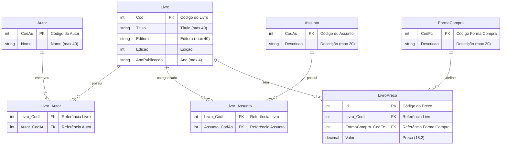

# 📊 Modelagem de Dados - Sistema de Cadastro de Livros

## Diagrama Entidade-Relacionamento

## 📋 Descrição das Tabelas

### Tabelas Principais

#### **Livro**
Armazena informações básicas dos livros.
- **CodI** (PK): Identificador único do livro
- **Titulo**: Título do livro (máximo 40 caracteres)
- **Editora**: Nome da editora (máximo 40 caracteres)
- **Edicao**: Número da edição
- **AnoPublicacao**: Ano de publicação (4 caracteres)

#### **Autor**
Cadastro de autores.
- **CodAu** (PK): Identificador único do autor
- **Nome**: Nome do autor (máximo 40 caracteres)

#### **Assunto**
Categorias/assuntos dos livros.
- **CodAs** (PK): Identificador único do assunto
- **Descricao**: Descrição do assunto (máximo 20 caracteres)

#### **FormaCompra**
Canais de venda dos livros.
- **CodFc** (PK): Identificador único da forma de compra
- **Descricao**: Descrição (ex: Internet, Balcão) (máximo 20 caracteres)

### Tabelas de Relacionamento

#### **Livro_Autor** (N:N)
Relacionamento muitos-para-muitos entre livros e autores.
- **Livro_CodI** (FK): Referência ao livro
- **Autor_CodAu** (FK): Referência ao autor
- **Chave Primária Composta**: (Livro_CodI, Autor_CodAu)

#### **Livro_Assunto** (N:N)
Relacionamento muitos-para-muitos entre livros e assuntos.
- **Livro_CodI** (FK): Referência ao livro
- **Assunto_CodAs** (FK): Referência ao assunto
- **Chave Primária Composta**: (Livro_CodI, Assunto_CodAs)

#### **LivroPreco** (1:N)
Preços dos livros por forma de compra.
- **Id** (PK): Identificador único do preço
- **Livro_CodI** (FK): Referência ao livro
- **FormaCompra_CodFc** (FK): Referência à forma de compra
- **Valor**: Preço do livro (decimal 18,2)
- **Índice Único**: (Livro_CodI, FormaCompra_CodFc) - Garante um preço único por forma de compra

## 🔍 VIEW para Relatórios

### **vw_livros_por_autor**
VIEW otimizada que agrega dados de livros agrupados por autor, incluindo:
- Informações do livro (título, editora, edição, ano)
- Dados do autor
- Lista de assuntos (concatenados)
- Lista de preços por forma de compra (concatenados)

Utilizada para geração dos relatórios em PDF e Excel.

## 📊 Cardinalidades

| Relacionamento | Tipo | Descrição |
|----------------|------|-----------|
| Livro → Livro_Autor | 1:N | Um livro pode ter múltiplos autores |
| Autor → Livro_Autor | 1:N | Um autor pode ter múltiplos livros |
| Livro → Livro_Assunto | 1:N | Um livro pode ter múltiplos assuntos |
| Assunto → Livro_Assunto | 1:N | Um assunto pode estar em múltiplos livros |
| Livro → LivroPreco | 1:N | Um livro pode ter múltiplos preços (um por forma de compra) |
| FormaCompra → LivroPreco | 1:N | Uma forma de compra pode estar em múltiplos livros |

## 🔑 Índices e Constraints

### Índices Únicos:
- `IX_LivroPreco_Livro_FormaCompra` - Garante que cada livro tenha apenas um preço por forma de compra

### Chaves Estrangeiras:
- Todas as tabelas de relacionamento possuem FKs com `ON DELETE CASCADE`
- Garante integridade referencial

### Validações:
- Títulos e nomes não podem ser vazios
- Edição deve ser maior que 0
- Valores de preço devem ser maiores que 0

## 🗄️ Tecnologia

- **Banco de Dados**: PostgreSQL 16
- **ORM**: Entity Framework Core 9.0
- **Migrations**: Gerenciadas pelo EF Core
- **Nomenclatura**: Mantida conforme especificação original do desafio

